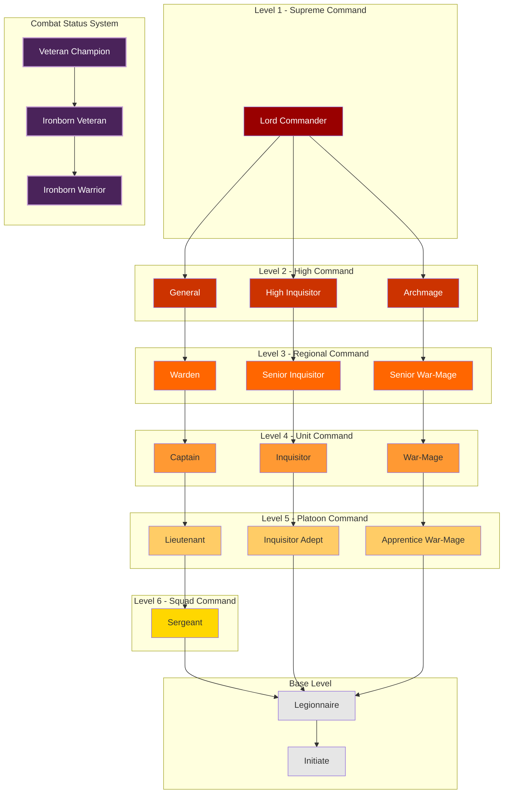

---
tags:
  - Military
  - Ranks
  - Overview
  - Governance
  - Crimson
Country's:
  - Crimson March
---
# The Emberfall Legion Overview

*"In the grim darkness of Bloodhollow, there is only war, and we are its masters."*  
— Lord Commander Aldric Blackthorn

---
## Introduction
The Emberfall Legion is the military force of the Crimson March, combining martial might, religious fervor, and arcane power. It serves as both an army and a governing body, maintaining order through strength and discipline.

## Core Components

### Three Primary Paths
1. **Military Command**
   - Traditional military hierarchy
   - Focuses on warfare and defense
   - Commands troops and fortifications
   - Example: General Darius Crownhold

2. **Inquisitorial Path**
   - Religious and judicial authority
   - Maintains spiritual purity
   - Investigates heresy and corruption
   - Example: High Inquisitor Varian Marrow

3. **War-Mage Path**
   - Magical warfare specialists
   - Controls Veilfire operations
   - Provides arcane support
   - Example: Archmage Selene Raventhorne

### Authority Levels

1. **Supreme Command (Level 1)**
   - Lord Commander
   - Supreme authority over all paths

2. **High Command (Level 2)**
   - General
   - High Inquisitor
   - Archmage

3. **Regional Command (Level 3)**
   - Warden
   - Senior Inquisitor
   - Senior War-Mage

4. **Unit Command (Level 4)**
   - Captain
   - Inquisitor
   - War-Mage

5. **Squad Command (Level 5)**
   - Lieutenant
   - Inquisitor Adept
   - Apprentice War-Mage
   - Sergeant

6. **Base Level**
   - Legionnaire
   - Initiate

### Combat Status System
A separate honor system that overlays all ranks and paths:

- **Veteran Champion:** Highest combat distinction
- **Ironborn Veteran:** Proven combat veteran
- **Ironborn Warrior:** Basic combat distinction

[[02. Combat Status Qualifications]] can be earned by any member of any path and provides additional authority in combat situations without changing formal rank.

---

## Basic Command Structure

### Chain of Command
- Rank level takes absolute precedence
- Within same level, authority depends on situation:
  - Military Command leads combat operations
  - Inquisitorial Path leads religious/security matters
  - War-Mage Path leads magical threats

### Special Positions
- **Wardens:** Command specific locations/fortifications
- **The Emberward:** Elite garrison forces
- **Cathedral Militant:** Religious warriors
- **Chainhold Guards:** Prison wardens

## Progression and Training

### Basic Requirements
- All paths start as Initiates
- Combat experience required
- Path-specific training and trials
- Minimum service times for advancement

### Specialization
- Chosen after achieving base competence
- Cannot usually switch between paths
- Can earn Combat Status in any path
- Additional training for specific roles

---
## Key Principles

### Authority
1. Rank level is primary
2. Path authority by situation
3. Combat Status influences tactical decisions
4. Domain authority for specific positions

### Command Priority
1. Supreme Command (Lord Commander)
2. Level authority (1-5)
3. Situational authority by path
4. Combat Status (in relevant situations)

---

*For detailed information about specific aspects of the Legion, refer to:*
- [[02. Combat Status Qualifications]]
- [[03. Military Command Structure]]
- [[04. Specialist Path Guide]]
- [[05. Warden Authority Protocols]]