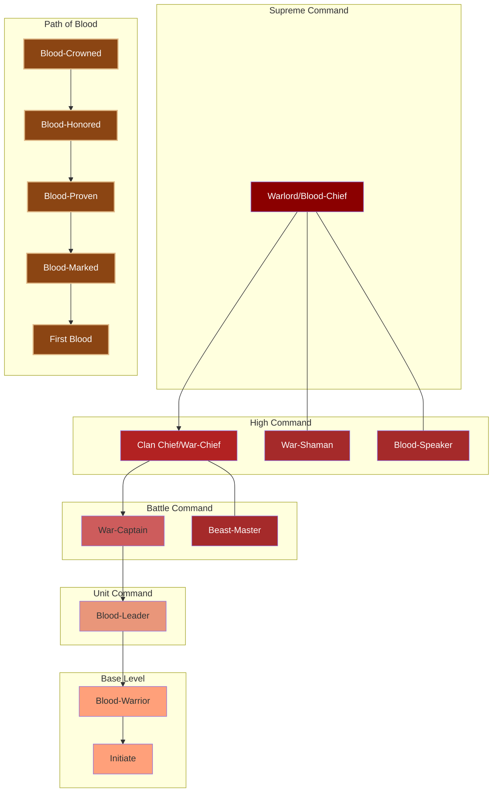

---
tags:
  - Military
  - Ranks
  - Overview
  - Governance
  - Ironclaw
  - Orcs
Country's:
  - Kraggmort
  - Zruk'mar
---
# The Ironclaw Command Structure

*"Strength ain't no river dat flows gentle-like. It's da blood dat pumps from yer heart straight to yer smashin' fist. Dat's how ya know it's real."*
— Warlord Thokk Ironhide

---
## Introduction
Unlike the complex hierarchies of humans and elves, orcish military structure follows a simple principle: the strong lead, the strongest leads all. Each position must be earned and maintained through might, with challenges to authority being both expected and encouraged to ensure only the most capable remain in power.

## Core Components

### Command Ranks
1. **Supreme Command**
   - Warlord (Blood-Chief)
   - Ultimate tribal authority
   - Example: Warlord Thokk Ironhide

2. **High Command**
   - Clan Chief (War-Chief)
   - Clan-level authority
   - Example: Krogan Bloodtusk

3. **Battle Command**
   - War-Captain
   - Warband leadership
   - Direct combat command

4. **Unit Command**
   - Blood-Leader
   - Pack leadership
   - Hunt command

5. **Base Level**
   - Blood-Warrior
   - Basic combat unit

---
# The Ironclaw Command Structure

*"Strength flows like blood - from the heart to the fist."*  
— Warlord Thokk Ironhide

## Overview
Unlike the complex hierarchies of humans and elves, orcish military structure follows a simple principle: the strong lead, the strongest leads all. Each position must be earned and maintained through might, with challenges to authority being both expected and encouraged to ensure only the most capable remain in power.

## Core Command Ranks

### Supreme Command
**Warlord (Blood-Chief)**
- Commands: Entire Tribe/Kingdom (When United)
- Example: Warlord Thokk Ironhide
- Requirements:
  - Victory in multiple clan wars
  - Personal defeat of previous warlord
  - Command of significant warhost
  - Recognition by clan chiefs
- Responsibilities:
  - Ultimate military authority
  - Inter-clan diplomacy
  - War declaration
  - Resource distribution

### High Command
**Clan Chief (War-Chief)**
- Commands: Major Clan (1,000-3,000)
- Example: Krogan Bloodtusk
- Requirements:
  - Leadership of successful raids
  - Personal combat prowess
  - Strong warband following
  - Clan recognition
- Responsibilities:
  - Clan leadership
  - Territory defense
  - Resource management
  - Raid organization

### Battle Command
**War-Captain**
- Commands: Warband (200-500)
- Requirements:
  - Multiple victories in combat
  - Leadership of successful hunts
  - Personal warrior reputation
  - Warband loyalty
- Responsibilities:
  - Direct battle command
  - Raid leadership
  - Warrior training
  - Resource raiding

### Unit Command
**Blood-Leader**
- Commands: Hunting Pack (50-100)
- Requirements:
  - Proven combat skill
  - Hunt leadership
  - Pack loyalty
  - Personal strength
- Responsibilities:
  - Pack leadership
  - Combat training
  - Resource gathering
  - Territory patrol

### Base Level
**Blood-Warrior**
- Basic warrior unit
- Requirements:
  - Combat initiation
  - Hunt participation
  - Pack acceptance
- Responsibilities:
  - Combat duty
  - Hunt participation
  - Pack support

## Special Positions

### War-Shaman
- Spiritual/magical guidance
- Battle omens
- Ritual combat blessing
- Ancestor communication

### Blood-Speaker
- Clan history keeper
- Battle storyteller
- Victory recorder
- Tradition maintainer

### Beast-Master
- War beast training
- Mount management
- Beast ritual leadership
- Hunt mastery

## Advancement System

### Path of Blood
Traditional advancement through combat prowess:
1. First Blood (Initial combat victory)
2. Blood-Marked (Multiple victories)
3. Blood-Proven (Leadership experience)
4. Blood-Honored (Command experience)
5. Blood-Crowned (Supreme leadership)

### Requirements
- Combat victories required
- Personal challenges accepted
- Warrior followers gained
- Battle scars earned

### Challenge Rights
- Any warrior may challenge direct superior
- Challenges must be witnessed by clan
- Victory grants challenger's position
- Defeat typically means death

## Command Principles

### Authority Basis
1. Personal strength
2. Combat victories
3. Follower loyalty
4. Battle success

### Leadership Right
1. Must be maintained through strength
2. Can be challenged by any subordinate
3. Requires constant demonstration
4. Based on recent victories

### Resource Control
- Distributed by strength
- Taken through might
- Held by power
- Shared with loyal followers

## Training and Advancement

### Warrior Training
- Combat focus
- Survival skills
- Weapon mastery
- Pack tactics

### Leadership Development
- Victory accumulation
- Follower gathering
- Territory claiming
- Strength demonstration

### Special Training
- War beast handling
- Raid tactics
- Battle strategy
- Resource warfare

## Inter-Clan Relations

### Tribal Gatherings
- Strength demonstrations
- Leadership challenges
- Resource trading
- Alliance forming

### War Councils
- Battle planning
- Resource division
- Territory claims
- Alliance confirmation

### Conflict Resolution
- Direct combat
- Challenger battles
- Resource wars
- Territory fights

---

*"Ya lead til someone bigger breaks ya. Dat's da way it's always been, dat's da way it's gonna stay. Simple as crushed bones."*
— From the Blood-Speaker's Chant

---

- [[02. Blood-Rank Trials - How ya prove yer worthy of command]]
- [[03. Warchief's Rules - Who gets ta boss who around]]
- [[04. War-Shaman's Ways - All dat spirit-touched stuff]]
- [[05. Territory Laws - How ya hold what ya take]]