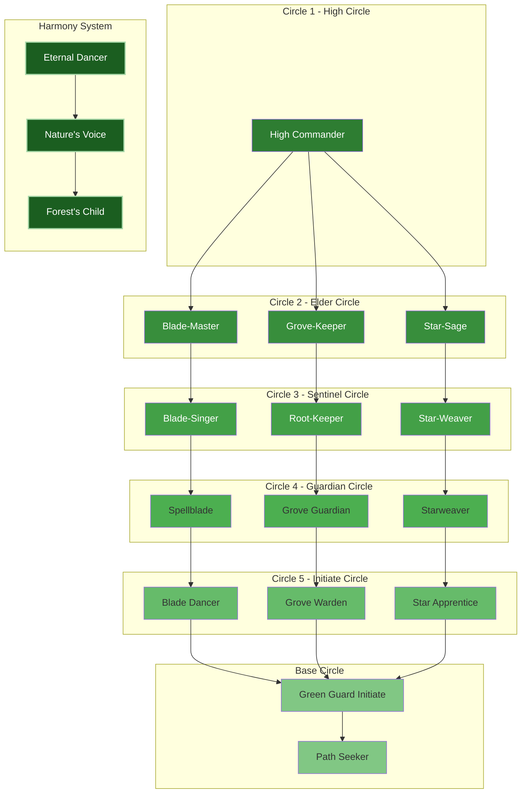

---
tags:
  - Military
  - Ranks
  - Overview
  - Governance
  - Mythrendil
Country's:
  - Mythrendil
---
# The Green Guard Overview

*"Between leaf and starlight, we are the eternal dance of blade and spell."*  
— High Commander Aelindra Starweaver

## Introduction
The Green Guard serves as both the military force and protectors of Mythrendil's natural harmony. Unlike human armies that impose order through force, the Green Guard maintains balance through the integration of martial prowess, magical mastery, and spiritual connection to the natural world.

## Core Components

### Three Primary Paths
1. **Spellblade Path**
   - Combines martial and magical combat
   - Masters of enchanted weaponry
   - Tactical battlefield control
   - Example: Blade-Singer Aethel Dawnweave

2. **Grove Guardian Path**
   - Natural and defensive magic
   - Environmental manipulation
   - Protectors of sacred sites
   - Example: Rootkeeper Faelindril Thornguard

3. **Starweave Path**
   - Pure magical combat
   - Celestial and nature magic
   - Strategic magical support
   - Example: Starweaver Maeris Dawnwhisper

### Authority Circles

1. **The High Circle (Circle 1)**
   - High Commander
   - Supreme authority over all paths

2. **The Elder Circle (Circle 2)**
   - Blade-Master
   - Grove-Keeper
   - Star-Sage

3. **The Sentinel Circle (Circle 3)**
   - Blade-Singer
   - Root-Keeper
   - Star-Weaver

4. **The Guardian Circle (Circle 4)**
   - Spellblade
   - Grove Guardian
   - Starweaver

5. **The Initiate Circle (Circle 5)**
   - Blade Dancer
   - Grove Warden
   - Star Apprentice

6. **Base Circle**
   - Green Guard Initiate
   - Path Seeker

---
### Harmony System
A parallel recognition of one's connection to nature and magical attunement:

- **Eternal Dancer:** Highest attunement
- **Nature's Voice:** Proven harmony
- **Forest's Child:** Basic attunement

### Command Structure

#### Chain of Harmony
- Circle level determines primary authority
- Within same circle, authority flows based on situation:
  - Spellblades lead in direct combat
  - Grove Guardians lead in defensive operations
  - Starweavers lead in magical matters

#### Special Positions
- **Rootkeepers:** Command living fortifications
- **Blade-Singers:** Lead elite combat units
- **Grove Wardens:** Protect sacred sites
- **Deepwardens:** Guard underground defenses

## Advancement and Training

### Core Requirements
- All begin as Path Seekers
- Must demonstrate magical aptitude
- Path-specific trials and attunements
- Minimum cycles of seasons for advancement

### Path Selection
- Chosen after showing natural affinity
- Guided by senior members
- Can earn Harmony recognition in any path
- Additional training in specializations

---
## Key Principles

### Authority Flow
1. Circle level is primary
2. Path authority by situation
3. Harmony influences magical operations
4. Domain authority for sacred sites

### Command Priority
1. High Circle (High Commander)
2. Circle authority (1-5)
3. Situational authority by path
4. Harmony standing (in relevant situations)

---

*For detailed information about specific aspects of the Green Guard, refer to:*
- [[02. Harmony Recognition System]]
- [[03. Path Structures and Authority]]
- [[04. Sacred Site Protocols]]
- [[05. Integration with Natural Forces]]